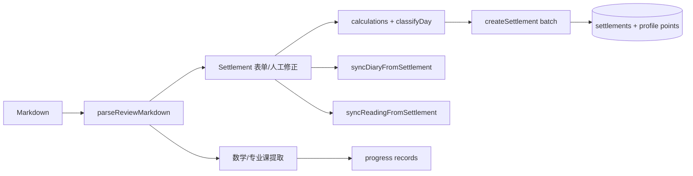

# Daily 项目地图

## 1. 文档说明

- 审计日期：2026-07-13（Asia/Shanghai）
- 审计分支：`main`
- 审计基线：`9cbc6eb`（`refine timeline drop interactions`）
- 审计范围：当前工作树、`package.json`、源码、README、Git 历史；未读取 `.env` 或任何真实用户数据。
- 本文限制：它描述当前代码证据，不把聊天记录或旧需求当作事实；不评定生产环境中 Firestore 规则、Vercel 环境变量是否已正确配置。

## 2. 项目概要

Daily（界面品牌为“小椰奖励商场”）是个人复盘、积分奖励、学习进度、阅读/日记档案与每日排程系统。前端是单页 React 应用：左侧导航用 `activeTab` 切换 13 个工作区；大部分领域组件仍集中在 [src/App.jsx](../src/App.jsx)。

| 维度 | 当前情况 | 代码证据 |
| --- | --- | --- |
| 技术栈 | React 18、Vite 6、JavaScript（非 TypeScript） | `package.json`、[src/main.jsx](../src/main.jsx) |
| UI/交互 | 手写 CSS、Lucide、dnd-kit | `src/styles.css`、`App.jsx` imports |
| 认证/云数据 | Firebase Auth（Google popup）+ Firestore | [src/services/firebase.js](../src/services/firebase.js)、[src/services/dataService.js](../src/services/dataService.js) |
| 本地兜底 | 未配置 Firebase 时启用 demo user 与 localStorage | [src/services/demoStore.js](../src/services/demoStore.js)、`App` 初始化 |
| 启动/构建 | `pnpm dev`、`pnpm run build`、`pnpm preview` | `package.json` |
| 测试/lint | 未声明 test、lint、typecheck 脚本，也未发现测试文件 | `package.json`、仓库文件清单 |
| 部署链路 | GitHub `main` 可触发 Vercel；仓库未见 `vercel.json` 或 GitHub Actions | README「部署到 Vercel」、仓库根目录 |

主要闭环：复盘 Markdown -> 解析结算 -> Firestore/localStorage -> 周总结、学习进度、日记与阅读同步；积分由结算、目标段和结项奖励进入奖励银行，再在商城兑换。

## 3. 系统全景图

```mermaid
flowchart LR
  Auth[Google Auth / Demo user] --> App[App shell + activeTab]
  App --> Settlement[每日结算与 Markdown 解析]
  Settlement --> Ledger[结算/积分记录]
  Settlement --> Progress[数学/专业课进度]
  Settlement --> Diary[日记档案]
  Settlement --> Reading[图书馆/阅读会话]
  App --> Planner[明日排程]
  Planner --> Profile[profile.scheduleAssistant*]
  App --> Mall[奖励商城与开发愿望]
  Mall --> Ledger
  Ledger --> Weekly[周总结/健康洞悉]
  Ledger --> Dashboard[首页目标、娱乐与段目标]
  App --> Store[(Firestore users/{uid}/*\n或 demo localStorage)]
  Profile --> Store
  Ledger --> Store
  Progress --> Store
  Diary --> Store
  Reading --> Store
```

## 4. 页面与入口地图

应用没有 React Router；以下“页面”均由 `tabs` 常量和 `activeTab` 条件渲染进入。[src/App.jsx](../src/App.jsx) 是全部入口的主证据。

| 页面 / 入口 | 触发方式 | 核心组件 | 主要功能 | 状态 |
| --- | --- | --- | --- | --- |
| 首页 | `dashboard` Tab | `Dashboard` | 积分、娱乐、倒计时目标、今日段目标、结项奖励入口 | 已实现 |
| 每日结算 | `settlement` Tab | `Settlement` | 粘贴/解析 Markdown、编辑结算、保存、同步日记/阅读、进度识别 | 已实现 |
| 明日排程 | `schedule` Tab | `ScheduleAssistant` | 任务池、固定事件、时间线、模板、局部重排、Undo/Redo、Prompt | 部分实现 |
| 奖励商场 | `mall` Tab | `Mall` | 商品浏览/兑换、内嵌商品管理、分类管理、开发愿望、Bug 愿望单 | 已实现 |
| 目标估算 | `estimator` Tab | `Estimator` | 选商品或自定义目标，估算完成天数并同步首页目标 | 已实现 |
| 周总结 | `weekly` Tab | `WeeklySummary` | 自然周/滚动/自定义区间、一级/二级时间分布、趋势、健康洞悉、CSV | 已实现 |
| 英语追踪 | `english` Tab | `EnglishTrackingPage` | 按日显示单词/雅思专项及备注抽屉 | 已实现 |
| 日记档案 | `diary` Tab | `DiaryArchivePage` | 标签筛选、全文展开、编辑、全屏编辑、热力图、CSV | 已实现 |
| 小椰图书馆 | `library` Tab | `LibraryHomePage`、`LibraryPage` | 书架、阅读趋势、热力图、书籍和会话详情 | 已实现 |
| 数学进度 | `mathProgress` Tab | `MathProgressPage` | 高数/线代/概率课程与习题勾选、日期记录、完成庆祝 | 已实现 |
| 专业课进度 | `professionalProgress` Tab | `ProfessionalProgressPage` | 清华 431 课程目录与勾选记录 | 已实现 |
| 历史记录 | `records` Tab | `Records` | 结算/兑换记录、撤回、回滚、日记重同步、结项申请编辑 | 已实现 |
| 设置 | `settings` Tab | `SettingsPage` | 目标图、标签、娱乐快捷项、事件簿链接及个人偏好 | 已实现 |

无独立路由的关键工作区：`LoginScreen`、结项申请面板、娱乐加时面板、日记/书籍编辑器、商品与分类内嵌管理器、排程任务/固定事件编辑模态框、模板管理器、拖放冲突模态框、移动端任务移动抽屉、恢复排程预览、保存/应用模板对话框。它们均有可达 UI 触发器；未发现独立移动端页面，移动端通过 CSS 与 `TaskMoveSheet` 降级交互。

## 5. 功能模块地图

### 复盘、结算与积分

- 入口：每日结算；历史记录可撤回/回滚。
- 文件：[src/App.jsx](../src/App.jsx)、[src/utils/reviewParser.js](../src/utils/reviewParser.js)、[src/utils/calculations.js](../src/utils/calculations.js)、[src/utils/dayType.js](../src/utils/dayType.js)、[src/services/dataService.js](../src/services/dataService.js)。
- 核心数据：`settlements`、`profile.points`、娱乐日志、`subjects`、`state`、`health`。
- 行为：识别复盘日期、学科/工作/家庭/杂项/娱乐/睡眠/状态/健康补充；计算学习、运动、睡眠、工作、娱乐与日型积分；同一保存链路可同步日记和阅读。
- 状态：已实现。证据为 `parseReviewMarkdown`、`createSettlement` 及 `Settlement.submit`。
- 限制：Markdown 识别依赖关键词/正则；不认识的表达会落空或进入杂项，无法从代码保证自然语言全覆盖。

### 明日排程与时间线

- 入口：明日排程 Tab；首页段目标与上一份复盘提供上下文。
- 文件：[src/App.jsx](../src/App.jsx) 的 `ScheduleAssistant`、`buildAutoSchedulePlan`、`TimelinePreview`、`DayTemplateManager`。
- 数据：`profile.scheduleAssistantSettings`、`scheduleAssistantDraft`、`scheduleSegmentGoals`；任务组、段、固定事件、覆盖项与模板均嵌入 profile。
- 行为：预设/自定义任务池、固定事件、自动排程、时间线拖放、交换/插入/冲突压缩、完成、锁定、局部清空/重排、撤销/重做、模板和 Prompt。
- 状态：部分实现。代码存在完整可达主流程；但时间线拖拽在最近连续提交中仍被反复修正（`24cc50e` 至 `9cbc6eb`），且无自动化交互测试，不能据此断言所有桌面/触屏边界稳定。

### 奖励商城、兑换与开发愿望

- 入口：奖励商场 Tab。
- 文件：`Mall`、`InlineProductManager`、`DevelopmentPlanPanel`、`BugFixPanel`，以及 `dataService` 的商品/兑换/开发愿望函数。
- 数据：`categories`、`products`、`redemptions`、`developmentPlans`、profile points。
- 行为：类别/商品 CRUD、排序、积分兑换、装修/功能愿望、按预计分钟算分、完成愿望形成日志；Bug 项使用同一愿望单路径。
- 状态：已实现。开发愿望每日限制在 App action 层执行，Bug 类不受该限制。

### 学习进度与英语追踪

- 文件：[src/utils/mathProgress.js](../src/utils/mathProgress.js)、[src/utils/professionalProgress.js](../src/utils/professionalProgress.js)、`MathProgressPage`、`ProfessionalProgressPage`、`EnglishTrackingPage`。
- 数据：`mathProgress`、`professionalProgress`、结算 `subjects`。
- 行为：数学按网课/习题分别完成及可选日期；专业课目录由源码内 Markdown 解析；复盘文本可提取数学和专业课推进；英语从结算的基础英语/雅思记录聚合。
- 状态：已实现。
- 限制：专业课目录不是后台配置或独立文档，而是 `professionalProgress.js` 内嵌常量；新增课程需要改代码。

### 周总结、时间账本与健康洞悉

- 文件：[src/utils/weeklySummary.js](../src/utils/weeklySummary.js)、`WeeklySummary`、`HealthInsightsPanel`、[src/utils/exportCsv.js](../src/utils/exportCsv.js)。
- 数据：`settlements`，另有 UI 偏好 localStorage key。
- 行为：周一至周日、上一/下一周、最近 7 天、自定义范围；一级和二级时间分类切换；睡眠排除；娱乐类型饼图；健康、状态和连续性；CSV 导出。
- 状态：已实现。
- 限制：只有已保存结算会出现在统计；“实际质量”指标仍受解析数据完整度约束。

### 日记与阅读图书馆

- 文件：[src/utils/diaryParser.js](../src/utils/diaryParser.js)、[src/utils/reading.js](../src/utils/reading.js)、`DiaryArchivePage`、`LibraryHomePage`、`dataService` 的 sync 函数。
- 数据：`diaryEntries`（日期为文档 ID）、`books`、`readingSessions`。
- 行为：复盘日记 section 预览/覆盖策略同步；手工编辑和标签；日记热力图；阅读自动同步、手动书籍编辑、书架/趋势/会话和书籍感受。
- 状态：已实现。
- 限制：同日同书会话 ID 为 `date_bookId`，其设计是 upsert 一条而非保存多次独立会话。

### 娱乐、目标、结项与账户

- 文件：`EntertainmentControlPanel`、`SegmentGoalBoard`、`ProjectRewardApplicationPanel`、`DashboardGoalStatCard`、`SettingsPage`、`calculations.js`、`dayType.js`。
- 数据：`entertainmentLogs`、`entertainmentExtensions`、`projectRewardApplications`、profile 目标/快捷项/娱乐标签。
- 行为：固定 90 分钟自由娱乐计分、当日加时兑换、首页快捷打卡、段目标奖励、目标图片/倒计时、结项申请与人工最终加分、Google 登录。
- 状态：已实现。
- 限制：事件簿只是用户保存的外链；无 WPS API 集成。通知是页面文案/小猫提示，并非系统推送。

## 6. 核心数据模型

| 实体 | 定义/读写位置 | 关键字段 | 关系与持久化 |
| --- | --- | --- | --- |
| Profile | `profileDefaults`、`saveProfileSettings` | `points`、娱乐设定、目标、排程 draft/settings、mask cycle | `users/{uid}`；全局配置中心 |
| Category | `saveCategory` | `name/icon/color/description` | `users/{uid}/categories`；商品引用 `categoryId` |
| Product | `saveProduct` | `name/categoryId/price/rarity/status/repeatable/sortOrder` | `products`；兑换产生 redemption |
| Settlement | `createSettlement` | `reviewDate/subjects/studyMinutes/pointsAdded/state/health/dayType` | `settlements`；周总结、英语、复盘历史主来源 |
| Redemption | `redeemProduct` 等 | `productName/price/remainingPoints/type` | `redemptions`；兑换/结项/娱乐加时共用流水 |
| EntertainmentLog | `saveEntertainmentLog` | `date/type/minutes/note` | `entertainmentLogs`；首页围栏即时记录 |
| EntertainmentExtension | `redeemEntertainmentExtension` | `date/minutes/pointsSpent/reason/checks` | `entertainmentExtensions`；同时有 redemption |
| DevelopmentPlan | `save/completeDevelopmentPlan` | `kind/type/estimatedMinutes/points/status/completedAt` | `developmentPlans`；`kind=bug` 复用此模型 |
| ProjectRewardApplication | `saveProjectRewardApplication` | `eventName/archived/requestedPoints/finalPoints/status` | `projectRewardApplications`；最终分数写入 profile/redemptions |
| MathProgress | `saveMathProgressRecord` | `itemId/courseCompleted/exerciseCompleted/courseDate/exerciseDate` | `mathProgress`；课程项来自 `mathCurriculum` |
| ProfessionalProgress | `saveProfessionalProgressRecord` | `itemId/completed/completedAt` | `professionalProgress`；目录来自内嵌课程文本 |
| DiaryEntry | `saveDiaryEntry/syncDiaryFromSettlement` | `date/title/content/tags/source/manuallyEdited` | `diaryEntries/{date}`；结算可 upsert |
| Book | `saveBookEntry/syncReadingFromSettlement` | `title/status/tags/totalMinutes/recentFeeling` | `books/{normalized title id}` |
| ReadingSession | `syncReadingFromSettlement` | `date/bookId/minutes/feeling/tags` | `readingSessions/{date_bookId}` |
| Schedule draft/settings | `ScheduleAssistant` | task overrides、segments、fixed events、templates、undo ephemeral state | profile 内嵌；无独立集合 |
| ScheduleSegmentGoal | `completeScheduleSegmentGoal` | `date/period/completedAt/rewardPoints` | profile `scheduleSegmentGoals`；完成时更新 points |

没有显式 TypeScript interface、schema validator 或数据版本字段。旧字段兼容主要以 `||`、`??` 和 demoStore 的初始化补齐实现。

## 7. 状态管理与持久化

- **全局/共享状态**：`App` 维护 `activeTab`、`user`、`loading`、`toast`、聚合 `data`；通过 actions 分派到 Firebase 或 demo store。
- **领域页面状态**：各大型组件使用 `useState`；排程拥有局部 draft、拖拽预览、undo/redo stacks、模态状态，均未使用 Context/Redux/Zustand。
- **临时状态**：拖放 preview、编辑表单、弹窗、toast、排程 undo/redo 只在内存，刷新后不保留。
- **云同步**：登录后 `subscribeUserData` 为 profile 与 13 个子集合建立 `onSnapshot`，每次回调把聚合对象交回 `App`。
- **Demo 持久化**：一个 key `yeye_reward_bank_demo_v2` 保存整个对象；周总结另存显示偏好。
- **风险**：profile 同时承载全局设定和整套排程草稿，任何写 profile 的并发路径都可能在字段级 merge 之外产生最后写入覆盖；没有离线队列/冲突 UI/迁移版本；排程 Undo 不跨刷新或设备。

## 8. 存储地图

| 数据 | Firebase 路径/集合 | localStorage | 读写入口 | 同步逻辑 | 备注 |
| --- | --- | --- | --- | --- | --- |
| Profile 与排程 | `users/{uid}` | demo aggregate | `saveProfileSettings`、`ScheduleAssistant` | Firestore snapshot / demo 整体保存 | 云端主路径为 profile 文档 |
| 商城分类/商品 | `categories`、`products` | demo aggregate | CRUD + snapshot | 实时监听 | 初次登录补种默认项目 |
| 结算/兑换 | `settlements`、`redemptions` | demo aggregate | `createSettlement`、兑换/回滚 | 实时监听 | 部分操作使用 batch |
| 学习进度 | `mathProgress`、`professionalProgress` | demo aggregate | 保存进度记录 | 实时监听 | item ID 来自代码目录 |
| 开发/bug 愿望 | `developmentPlans` | demo aggregate | save/complete/delete | 实时监听 | bug 与 feature 共集合 |
| 娱乐 | `entertainmentLogs`、`entertainmentExtensions` | demo aggregate | 快捷记录/兑换 | 实时监听 | 结算还会保存娱乐快照 |
| 日记/阅读 | `diaryEntries`、`books`、`readingSessions` | demo aggregate | 手工和结算同步 | 实时监听 | 日记/会话使用确定 ID |
| 周表显示偏好 | 无 | `yeye-weekly-table-keys-*` | `WeeklySummary` | 本地独立 | 只影响 UI 显隐 |

未发现 Realtime Database、Firebase Storage 使用、Cloud Functions、安全规则文件、Service Worker、sessionStorage 或 PWA 配置。`src/lib/firebase.js` 与 `src/services/firebase.js` 都存在；主 App 导入后者，前者在当前源码中未见引用，属疑似废弃配置副本。

## 9. 关键业务流程

### 复盘到积分、日记与阅读



### 计划与时间线

`profile.scheduleAssistantSettings` + 上一份结算上下文 -> `makeScheduleDraft` -> `buildPlannerTaskGroups/flattenPlannerTasks` -> `buildAutoSchedulePlan` -> 任务池/时间线。拖动、完成、锁定、调整与局部重排写回 profile draft；`plannerPast/plannerFuture` 仅提供会话内撤销/重做。

### 奖励与兑换

结算、段目标、结项奖励 -> profile `points`（部分同时写流水）-> 商城/娱乐加时在 batch 中扣 points 并生成 `redemptions`。普通商品的不可重复状态会回写 product；删除最新兑换会返还积分。

### 统计与档案

Firestore `settlements` -> `buildWeeklySummary` -> 周卡片/时间大表/健康图/CSV；`diaryEntries`、`books`、`readingSessions` 各自实时订阅，供档案与图书馆渲染。

## 10. 组件与服务架构

- **应用壳**：[src/App.jsx](../src/App.jsx) 同时承担导航、认证、actions、13 个页面及大量领域组件，是最强耦合点。
- **服务层**：[src/services/dataService.js](../src/services/dataService.js) 是唯一主要 Firestore repository；[demoStore.js](../src/services/demoStore.js) 模拟相同聚合数据。
- **纯工具层**：复盘解析、积分、日型、周统计、CSV、数学/专业课目录、日记与阅读规范化分离在 `src/utils/*`。
- **可复用 UI**：`TextField`、`NumberField`、`SelectField`、`InfoLine`、`ProgressCheck`、图表/卡片小组件；未形成独立 components 目录或设计系统。
- **重复/耦合**：`LibraryPage` 与 `LibraryHomePage` 并存；`src/lib/firebase.js` 与 `src/services/firebase.js` 重复；排程、周总结、日记都在 App 单文件中，跨领域修改容易扩大回归面。

## 11. 权限、账户与同步

- 登录方式：配置齐全时 `signInWithPopup(auth, googleProvider)`；否则使用固定 demo user。
- 用户隔离：所有 dataService 路径以 `users/{uid}` 为根。
- 同步：客户端 Firestore `onSnapshot`；无服务端业务逻辑、无显式乐观更新框架。
- 离线：Firebase SDK 自身可能有浏览器缓存能力，但应用未配置/声明离线策略，无法确认预期离线行为。
- 安全：README 提醒配置安全规则，但仓库没有规则文件，无法审计是否真正限制 `request.auth.uid`。

## 12. 构建、测试与部署

| 项目 | 可用情况 |
| --- | --- |
| 开发 | `pnpm dev` |
| 构建 | `pnpm run build`；本审计前一轮已通过，产物提示 JS chunk 超过 500 kB |
| 预览 | `pnpm preview` |
| 单测/组件/E2E | 未发现脚本或测试文件 |
| lint/typecheck | 未发现脚本；JavaScript 项目 |
| Vercel | README 说明 GitHub 导入与 `VITE_FIREBASE_*` 环境变量；无仓库内配置 |
| Firebase | Web Auth/Firestore，变量在 `.env` 供 Vite 读取；真实值未审计 |

## 13. 项目演化概览

| 阶段 | 关键提交 | 当前意义 |
| --- | --- | --- |
| 初始奖励系统 | `1831f9a`（2026-06-30） | 当前商城/结算基础仍有效 |
| 娱乐与排程起步 | `786a30e`、`f61f979`（2026-06-30/07-01） | 固定娱乐额度和排程主干的起点 |
| 复盘、阅读、日记扩展 | `c9ba7da`、`1886ad7`、`fda75f1`（07-04/05） | 同步与档案主路径仍在使用 |
| 周总结/健康重构 | `025f757`、`c993dc6`、`0bf84f0`（07-07/09） | 当前周总结与健康洞悉仍有效 |
| 排程时间线重构 | `24cc50e` 至 `9cbc6eb`（07-10/13） | 当前排程实现；提交密集，稳定性需人工验证 |

## 14. 当前实现状态总表

| 模块 | 主要状态 | 说明 |
| --- | --- | --- |
| 认证与云同步 | 已实现 | Google Auth + Firestore snapshot |
| Demo 本地模式 | 已实现 | 一个聚合 localStorage store |
| 每日复盘/结算 | 已实现 | 解析、编辑、保存与回滚入口 |
| 积分/娱乐规则 | 已实现 | `calculations.js`、`dayType.js` |
| 奖励商城 | 已实现 | CRUD、排序、兑换 |
| 开发/bug 愿望 | 已实现 | 共用 developmentPlans |
| 日记档案 | 已实现 | 同步/手工编辑/热力图 |
| 阅读图书馆 | 已实现 | 书籍/会话/趋势 |
| 数学进度 | 已实现 | 网课/习题分列 |
| 专业课进度 | 已实现 | 内嵌 431 目录 |
| 英语追踪 | 已实现 | 结算聚合 |
| 周总结/健康洞悉 | 已实现 | 多口径/二级分类/CSV |
| 目标/结项奖励 | 已实现 | 目标设置、人工结项 |
| 明日排程主流程 | 部分实现 | 可用但近期拖拽交互反复修正且无测试 |
| 计划模板 | 部分实现 | 可管理/应用；与旧模板兼容转换并存 |
| 自动排程 | 部分实现 | 有算法和恢复预览；未见可验证的复杂冲突测试 |
| 本地 UI 偏好 | 已实现 | 周表显隐 key |
| `src/lib/firebase.js` | 疑似废弃 | 当前主路径使用 `services/firebase.js` |
| PWA/推送/离线产品能力 | 仅规划或不存在 | 未见代码/配置 |

计数：18 个主要模块中，14 个已实现、3 个部分实现、0 个仅规划、1 个疑似废弃、0 个无法确认（PWA/推送按“不存在”处理，不计业务模块）。

## 15. 已知技术债与风险

### 高

1. [src/App.jsx](../src/App.jsx) 是超大单体，导航、认证、领域 UI 和排程算法共处，任何改动的回归面很大。
2. 没有单测/E2E/lint；排程拖放是近期高频修复区，现阶段只能靠人工验证。
3. Firestore 安全规则不在仓库，用户数据隔离是否在生产环境强制执行无法从此代码库确认。

### 中

1. profile 内嵌整个排程草稿/模板/目标/设置，跨设备同时编辑存在最后写入胜出的风险。
2. demo store 是单一 JSON 文档，结构演进依赖手工补字段；没有版本化迁移。
3. `dataService` 的多集合 snapshot 各自 emit，初始加载可产生短暂不完整聚合状态。
4. 前端生产 JS chunk 已超过 Vite 默认告警阈值。

### 低

1. `src/lib/firebase.js` 可能是未引用的旧初始化副本。
2. 图书馆有两个较相近的页面组件，增加维护认知成本。
3. README 的“已实现页面/Firestore 结构”是早期概览，未覆盖新增排程、日记、阅读、健康与项目奖励模块。

## 16. 文档与代码不一致之处

- README 标题和主叙事仍以“奖励商场”为中心；当前代码已是 Daily 复盘、排程、档案系统。
- README 的 Firestore 清单未列 `developmentPlans`、娱乐集合、结项申请、日记、书籍、阅读会话及排程 profile 字段。
- README 没有描述本地 demo 数据迁移、周总结 localStorage 偏好或排程 Undo 的会话范围。
- 代码存在 `src/lib/firebase.js`，但 README 只描述一个 Firebase 配置入口；当前应用实际使用 `src/services/firebase.js`。

## 17. 需要用户确认的产品问题

1. 排程模板是否应成为长期“可跨日期复用的产品资产”，还是仅保留当前日草稿的快捷复制？这决定 profile 内嵌是否仍合适。
2. 在多设备同时打开排程时，哪一端应优先？目前没有冲突提示或版本策略。
3. 专业课目录是否应允许在 UI 中扩展/替换？当前只能随代码发布更新。
4. 日记同步覆盖手工日记的默认策略是否仍应为 overwrite？代码支持策略，但长期默认意图无法由代码判断。
5. 娱乐日志与结算里的娱乐快照发生不一致时，哪一个应是周统计的最终来源？当前周总结主要消费 settlement。
6. 是否需要把 Firebase 安全规则、备份/导出和恢复流程纳入仓库长期维护？当前无法审计或复现。

## 18. 后续文档建议

- 适合未来放入 `AGENTS.md`：数据写入边界、`profile` 字段合并规则、FireStore collection 命名、排程交互不变量、不得读取密钥。
- 适合未来放入 `STATUS.md`：当前发布 commit、已验证浏览器场景、待验排程拖拽边界、当前部署状态。
- 值得独立 feature 文档：每日结算 Markdown 语法、积分规则、排程数据模型与交互、Firestore 安全/备份策略。
- 不值得长期维护：旧 PR 式需求文本、单次视觉参考、已经被当前 `tabs` 覆盖的旧页面命名。

## 审计自查

- 覆盖了全部 13 个 Tab、主要模态/抽屉、Firestore 13 个订阅集合、已发现的 localStorage keys、奖励/复盘/学习/排程/档案领域。
- 未输出密钥、Token、真实账号或真实用户数据。
- 本轮只新增本文件；未运行 build/test/lint，以避免把“构建通过”误写为功能验证。
